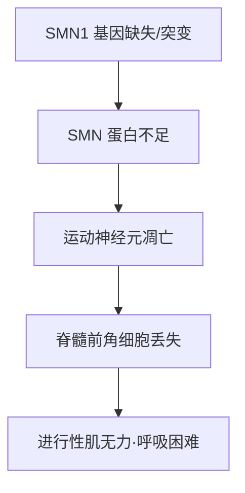
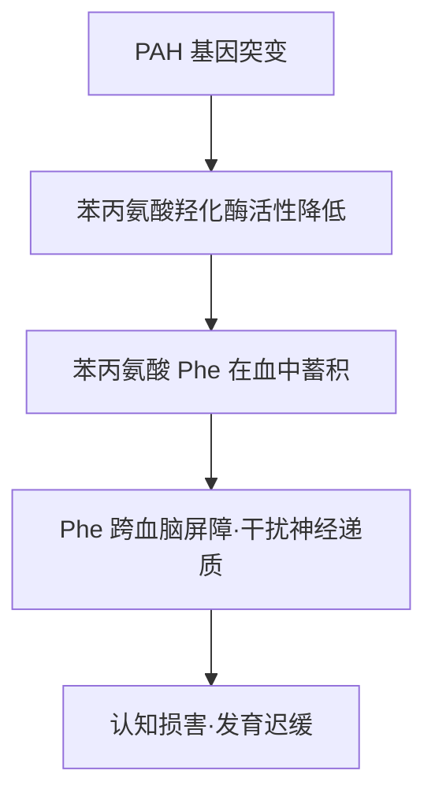
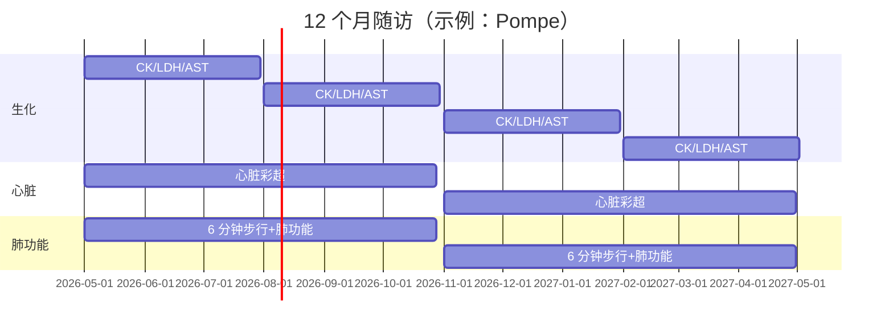
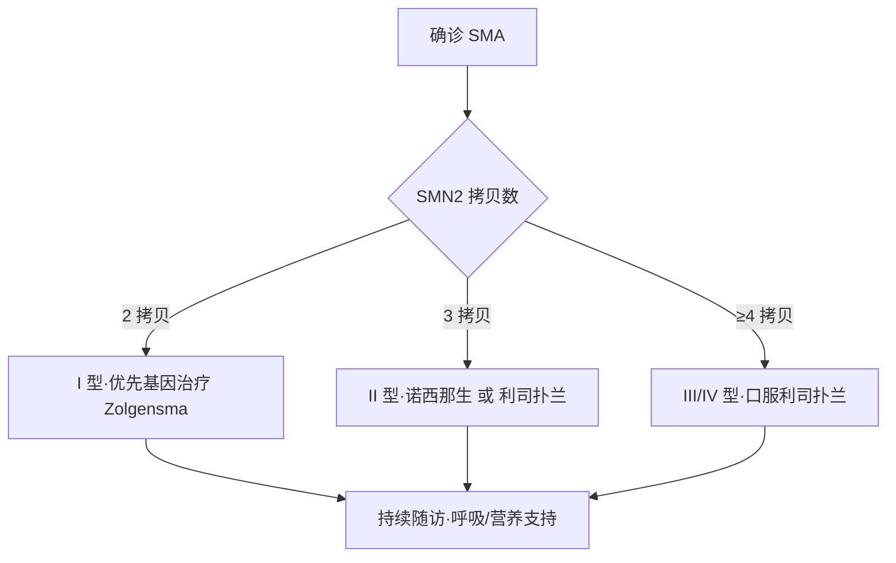
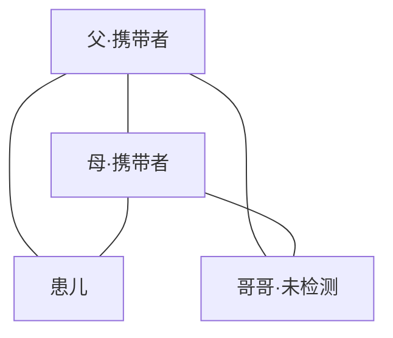
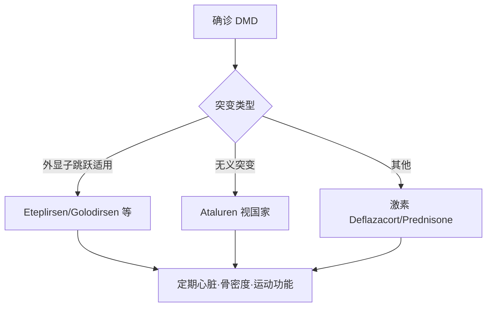

# 罕见病患教手册模板库 (education-template.md)

本文件是 `firefly-education` 的结构化模板库。每章给出：模板骨架 + 填充指南 + 迷你样例。所有样例病种可替换为 profile.json 中的实际病种。

---

## 1. 文件命名约定

格式：`{patient_id}_{YYYY-MM-DD}_罕见病患教手册.md`

- `patient_id`：来自 profile.json 的脱敏 ID（示例 `P20260424-A12`）
- 日期：生成当日
- 多版本：追加 `_v2`、`_v3`（例 `P20260424-A12_2026-04-24_罕见病患教手册_v2.md`）
- 重大修订（换药、新诊断）必须新版本，不覆盖旧版

---

## 2. 手册结构

### 2.1 快速参考卡（封面）

单页 A4，可折叠携带。字段齐全优先于美观。

**模板**
```markdown
# 快速参考卡 🚨
> 紧急情况请立即出示此页

| 项 | 内容 |
|---|---|
| 姓名 | {name} |
| 出生日期 | {birth} |
| 诊断（中/英） | {dx_zh} / {dx_en} |
| 基因/变异 | {gene} {variant} |
| 主治医生 | {doctor} ({hospital} {dept}) |
| 医生电话 | {phone} |
| 紧急联系人 | {kin} {kin_phone} |
| 过敏 | {allergy} |
| 当前用药 | {med_list_short} |

**急诊 1-2-3**
1. 带：本手册 + 最近一次病历/基因报告 + 当前药盒
2. 去：{preferred_er_hospital}（24h 有本病经验）
3. 告知分诊：「我是 {dx_zh} 患者，请查看此卡」
{if 代谢病}4. 出示 emergency letter（见 §2.10）{endif}
```

**填充指南**：代谢病必须勾选 emergency letter；无固定医生写「未建档」并标红。

---

### 2.2 我得的是什么病（My Health Summary）

一段话，四句：病名 + 机制 + 影响 + 目标。避免术语。

**模板**
```
我得的病叫 **{中文名}（{英文名}，简称 {abbr}）**。
我的身体里 **{基因}** 这个零件不工作了，导致 **{蛋白/代谢物}** {缺少/堆积}。
这会让 **{器官}** 慢慢 **{表现}**。
我们现在要做的事：**{治疗目标一句话}**。
```

**SMA 样例**
> 我得的病叫脊髓性肌萎缩症（SMA）。我身体里 SMN1 这个零件不工作了，运动神经元得不到足够的 SMN 蛋白保护，会慢慢死掉。这会让我手脚没力气、呼吸也变弱。我们现在要做的事：每天吃利司扑兰补蛋白，让神经元活下来。

**PKU 样例**
> 我得的病叫苯丙酮尿症（PKU）。我身体里 PAH 这个酶不够用，饭里的苯丙氨酸（Phe）拆不掉，会在脑子里越堆越多。堆多了会影响我学习和思考。我们现在要做的事：吃特殊食物，让 Phe 一直很低。

---

### 2.3 疾病机制图（Mermaid flowchart）

标准 5 层：基因 → 蛋白 → 细胞/代谢 → 器官 → 症状。

**SMA 示例**


**PKU 示例**


---

### 2.4 当前用药

**Warning**：本章**不写具体剂量数字**，只写「按最新处方」。具体 mg/kg 由医生处方决定，手册写死会误导。

**模板**
| 药名（中/英） | 作用 | 剂量 | 最佳时间 | 主要副作用 | 漏服处理 | 禁忌合用 |
|---|---|---|---|---|---|---|
| {drug_zh} ({drug_en}) | 一句话 | 按最新处方 | {timing} | {ae_top3} | {missed_dose_rule} | {contra_list} |

**SMA 示例（利司扑兰）**
| 药名 | 作用 | 剂量 | 最佳时间 | 主要副作用 | 漏服处理 | 禁忌合用 |
|---|---|---|---|---|---|---|
| 利司扑兰（Risdiplam/Evrysdi） | 促进 SMN2 剪接产生全长 SMN 蛋白 | 按最新处方 | 每日同一时间，饭后 | 腹泻、皮疹、发热 | 距原时间 <6h 补服；≥6h 跳过 | 多重耐药蛋白 MATE 底物谨慎 |

---

### 2.5 日常生活指南

- **饮食**：若有 firefly-diet 产出则嵌入；否则写"按医嘱"。PKU/MSUD 等代谢病必须展开。
- **运动**：病种特异
  - Pompe：避免过载，勿力竭
  - DMD/BMD：禁 eccentric（下坡/离心）动作
  - SMA：按 I/II/III/IV 型分级，II-III 型鼓励水疗
- **睡眠**：呼吸系统受累者评估无创通气
- **旅行清单**：emergency letter、特医食品（代谢病必带）、2 倍药量、英文诊断书、当地专科医院电话
- **疫苗**：多数罕见病可正常接种；免疫抑制治疗期间活疫苗禁用；咨询主治

---

### 2.6 随访日历

**Pompe 12 个月样例（gantt）**


**每项记录**：做什么 · 哪家医院 · 为什么 · 预期发现。例：「6 分钟步行 · 省儿童医院呼吸科 · 评估运动耐量 · 预期 ≥ 基线 90%」。

---

### 2.7 费用与援助

| 来源 | 适用条件 | 申请材料 | 联系方式 |
|---|---|---|---|
| 门诊慢特病 | 已纳入本省目录 | 诊断书+基因报告 | 市医保局 |
| 大病医保/二次报销 | 自付超起付线 | 发票汇总 | 参保地医保 |
| 国家医保谈判药 | 药品在目录内 | 处方+病历 | 定点药房/医院 |
| 厂家 PAP | 厂家名单 | 收入证明+诊断 | 厂家官网/400 |
| 中华慈善总会罕见病办 | 白名单病种 | 家庭经济评估 | cncaf.org |
| 省市专项 | 本省户籍 | 民政+残联证明 | 当地罕见病联盟 |

**提示**：部分 PAP 要求先自费若干周期再审批，保留发票原件。

---

### 2.8 治疗决策树（Mermaid）

> 本图**仅为结构示意**，任何分支切换以主治医生最新判断为准。

**SMA 婴儿样例**


---

### 2.9 FAQ（15 问模板）

**基础医学**
1. 这个病是什么引起的？
2. 为什么是我/我孩子？
3. 基因报告上的 `c.xxx>y` 什么意思？

**生活**
4. 能上学/上班吗？
5. 能运动吗？哪些不能做？
6. 能坐飞机/出国吗？

**遗传与生育**
7. 会遗传给下一胎吗？
8. 做产前诊断吗？
9. 能做 PGT（三代试管）吗？

**未来/预后**
10. 能活多久？→ **统一答案：预后因人而异，具体请与主治医生讨论；手册不给数字。**
11. 有没有治愈方法？
12. 最近有新药吗？→ 建议每 6 月更新手册时重新检索 clinicaltrials.gov

**心理**
13. 孩子问「我为什么和别人不一样」怎么回答？
14. 家长自己怎么调节？
15. 去哪找病友？→ 病痛挑战基金会、单病种患者组织

---

### 2.10 紧急情况

🔴 **红色警报症状**（病种特异，示例 Pompe）
- 呼吸困难、嘴唇发紫、说话断句
- 心率 >150 静息、胸痛
- 持续呕吐 >6h、嗜睡叫不醒

🟡 **黄色预警**
- 低热 >38.5°C 持续 >24h
- 进食/饮水明显减少

**立即行动 1-2-3**
1. 拿：本手册 + 急救包（药+emergency letter+最近病历）
2. 打：120 或直奔 {preferred_er}
3. 到院首句：「我是 {dx_zh} 患者，请联系 {doctor} 医生，我有 emergency letter」

**Emergency Letter 英文样例（代谢病跨境）**
```
To whom it may concern,

This patient, {NAME} (DOB {YYYY-MM-DD}), has {DISEASE, ICD-10 {CODE}}.
During acute illness / prolonged fasting, this patient is at risk of
{metabolic crisis / hypoglycemia / hyperammonemia}.

Please:
1. Start IV glucose 10% at maintenance + 20% immediately.
2. Do NOT give {contraindicated drugs / foods}.
3. Contact treating physician Dr. {NAME} at +86-{PHONE}.

Signed, {DOCTOR NAME}, {HOSPITAL}, {DATE}
```

---

## 3. 排版规范

- 标题：`#` 手册名 / `##` 章节 / `###` 小节；禁止跳级
- 表格：第一列短 label，≤4 字；避免 >6 列
- Emoji：仅在 section header 和警示符（🚨🔴🟡🟢💊📅）
- A4 打印：避免单表 >25 行；长表拆分
- Mermaid：全手册 ≤4 图，每章 ≤1 图
- 代码块：仅用于 Mermaid 和 emergency letter

---

## 4. Mermaid 参考代码块

**家系 pedigree（基础）**


**治疗决策树**：见 §2.8。

**随访甘特图**：见 §2.6。

**疾病机制**：见 §2.3。

---

## 5. 样例 snippet 库

### 5.1 SMA 1 岁婴儿
**我得的是什么**：见 §2.2 SMA 样例。
**当前用药**：利司扑兰口服液，按最新处方，每日同一时间饭后，副作用腹泻/皮疹，漏服 <6h 补服。
**随访**：每月体重、每 3 月 CHOP-INTEND 评分、每 6 月肺功能。

### 5.2 PKU 5 岁
**我得的是什么**：见 §2.2 PKU 样例。
**饮食要点**：每日 Phe 目标 {按医嘱} mg/kg；主食用低蛋白米面；禁高蛋白肉蛋奶豆；特医奶粉补氨基酸。
**紧急情况**：感冒发烧 >38.5 易 Phe 升高，记录饮食+尽快测血 Phe；出国随身带特医食品 + 英文说明（§2.10）。

### 5.3 DMD 10 岁
**治疗决策树**

**学校配合要点**：免修剧烈体育、楼层尽量低、允许课间缩短、IEP 个体化计划、应急联系卡在班主任处。

---

## 6. 声明

本手册为患者个人参考资料，**不是医疗建议**。所有诊疗决策以主治医生最新意见为准。研究进展快，建议**每 6 个月重新生成一次**（或诊断/用药发生变化时立即更新）。跨境就医请让主治医生审阅并签字英文版。
