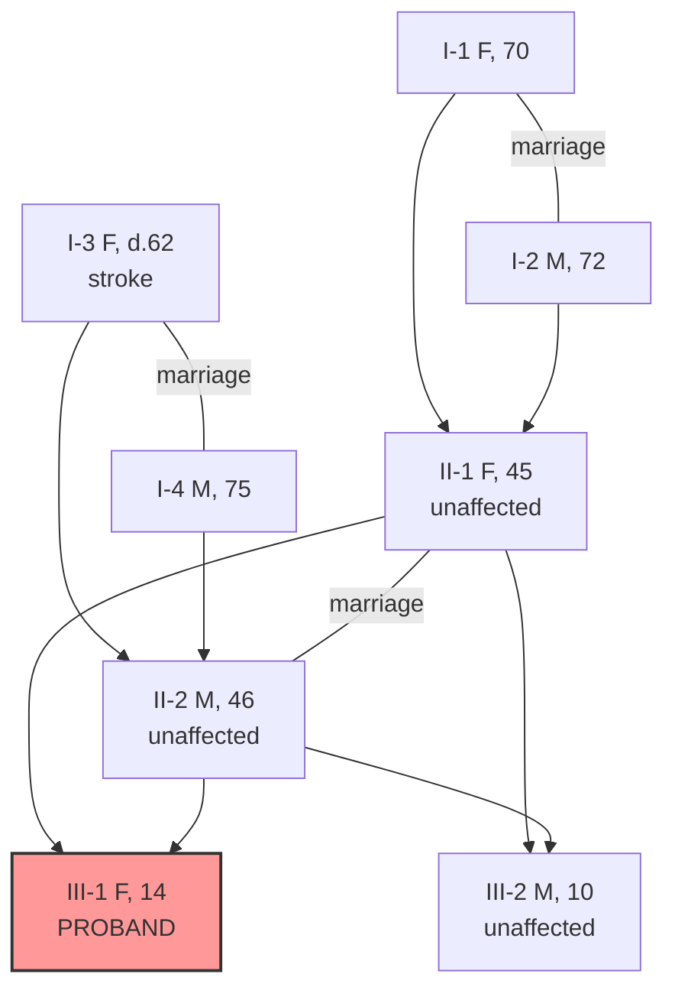

# English Case Packet Template & Writing Guide

本文件是 firefly-second-opinion 生成英文会诊材料的模板与写作规范。
所有产出的病例包 (case packet) 都应基于此模板，保持一致的结构、术语与脱敏程度，
以便海外专家（UDN / UDP-EU / Centogene / Mayo 等）用最短时间抓住关键事实。

---

## 1. Writing Rules for Case Packets

### 1.1 Length & Format

- **≤ 2 pages** when rendered to A4/Letter PDF (aim for ~800-1200 words)
- **Single column**, 11pt, 1.15 line spacing after PDF conversion
- Markdown source must be valid and render cleanly through pandoc/typst
- Tables for all structured data; prose only where structure hurts clarity
- Mermaid pedigree diagram inline; if >4 generations, attach as separate file

### 1.2 Terminology

- **Use standardized HPO terms** for every phenotypic finding
  - Pull canonical label from https://hpo.jax.org/
  - Always include `HP:XXXXXXX` id alongside the label
  - Do not paraphrase (e.g., write "Intellectual disability, mild" `HP:0011342`, not "mild learning delay")
- **Genes**: HGNC symbol (italic in final PDF, plain text in markdown)
- **Variants**: HGVS 3-letter protein, cDNA with transcript id, e.g., `NM_000518.5:c.20A>T (p.Glu7Val)`
- **ACMG classification** per 2015 Richards et al. criteria; state which criteria applied (PVS1, PM2, PP3, etc.)
- **Allele frequency**: gnomAD v4 (or latest), specify population if relevant

### 1.3 Chronology

- Diagnostic workup section **must** be in chronological order, oldest first
- Dates in `YYYY-MM` format (not `YYYY-MM-DD` — privacy)
- If exact month uncertain, use `YYYY` only

### 1.4 Objectivity

- Main body = observed facts only (test results, physical findings, imaging)
- Speculation, ruled-out differentials, and theories → **"Outstanding Questions"** section
- Do not editorialize the treating physician's decisions
- Do not include emotional language ("suffering", "heartbreaking") — clinical tone

### 1.5 PHI Removal — Never Include

- 真实姓名 / legal name
- 完整出生日期 / full birthdate (use age or age-range)
- 地址 / address (use country + region only)
- 医院病案号 / hospital MRN
- 身份证号 / national ID
- 保险号 / insurance ID
- 亲属姓名 / names of family members
- 原始面部照片 / identifiable face photos
- 未去 metadata 的 DICOM

### 1.6 Always Include

- **Anonymized ID** (e.g., `PT-2026-001`) — reusable across follow-up correspondence
- **Age** or age range at packet date
- **Sex at birth**
- **Self-reported ethnicity / ancestry** — critical for allele frequency interpretation
- **Country of residence** — for regulatory / data-use context
- **Proband role** — is the packet filled by patient, parent, or caregiver
- **Packet date** — `YYYY-MM-DD`
- **Target program** — UDN / ERN / Centogene / hospital X

---

## 2. Full Case Packet Template (English, Fill-in)

Copy the block below, replace bracketed fields, delete empty sections.

```markdown
# Consultation Case Packet · [PT-YYYY-NNN] · [YYYY-MM-DD]

## Requesting Consultation From
[Program / institution name, e.g., "UDN, Harvard clinical site" or "Centogene medical reanalysis"]

## Patient Overview
- Anonymized ID: [PT-YYYY-NNN]
- Age: [e.g., 14-year-old, or 10-14 range]
- Sex at birth: [Male / Female / Other]
- Self-reported ethnicity / ancestry: [e.g., Han Chinese, East Asian]
- Country of residence: China
- Proband role for this packet: [self / parent / caregiver / treating physician]
- Packet prepared by: [treating physician name and specialty, or "case coordinator"]

## Chief Complaint
[1-2 sentence clinical summary, e.g., "14-year-old female with progressive ataxia,
bilateral cataracts, and peripheral neuropathy of unknown etiology since age 7."]

## Key Clinical Findings (HPO)

| HPO ID | Term | Age of Onset | Severity / Notes |
|---|---|---|---|
| HP:0001251 | Ataxia | 7 y | Progressive, now wheelchair-bound |
| HP:0000518 | Cataract | 9 y | Bilateral, posterior subcapsular |
| HP:0009830 | Peripheral neuropathy | 10 y | Axonal on EMG, length-dependent |
| HP:XXXXXXX | [term] | [age] | [notes] |

## Physical Examination (selected)
- Height: [value, z-score]
- Weight: [value, z-score]
- Head circumference: [value, z-score] (if relevant)
- Key findings: [bulleted, relevant positives only; e.g., "dysarthria, wide-based gait, bilateral pes cavus"]

## Family History
[Prose description, 2-4 sentences. Include consanguinity, affected relatives,
relevant unaffected relatives, ages, causes of death if relevant.]

Example:
> Non-consanguineous Han Chinese parents, both clinically unaffected on recent
> examination. One younger brother (age 10) unaffected. Maternal grandmother died
> at age 62 of stroke; no known neurological disease on either side. No known
> rare disease history in extended family over 3 generations.

### Pedigree



## Diagnostic Workup (chronological)

| Date (YYYY-MM) | Institution | Test | Key Result |
|---|---|---|---|
| 2019-03 | Provincial Children's Hospital, China | Brain MRI | Mild cerebellar atrophy |
| 2020-06 | Peking Union Medical College Hospital | Panel (ataxia, 120 genes) | Negative |
| 2021-09 | Same | Trio WES | VUS in GENE1; non-contributory |
| 2023-02 | Same | Brain MRI f/u | Progressive cerebellar atrophy |
| 2024-05 | Provincial hospital | Nerve conduction study | Axonal sensorimotor polyneuropathy |

## Genetic Findings

| Gene | Transcript | cDNA variant | Protein | Zygosity | Inheritance | ACMG | gnomAD v4 AF |
|---|---|---|---|---|---|---|---|
| GENE1 | NM_XXXXXX.X | c.XXXA>G | p.XxxXxx | Het | De novo (trio confirmed) | VUS (PM2_Supporting, PP3) | Absent |
| GENE2 | NM_XXXXXX.X | c.XXXdel | p.XxxfsTer | Het | Maternal | LP (PVS1, PM2) | 1.2e-5 |

Raw data status: FASTQ/BAM retained at [lab name]; VCF attached (filtered for rare variants AF<0.01).

## Differential Diagnosis Considered and Outcome

- **Friedreich ataxia**: Considered; ruled out by GAA repeat sizing (normal, <30 repeats) in 2020.
- **SCA panel (SCA 1, 2, 3, 6, 7, 8, 17)**: All repeat sizes within normal range.
- **Mitochondrial disease**: Muscle biopsy 2022 normal; lactate/pyruvate normal; mtDNA sequencing negative.
- **Autoimmune cerebellar ataxia**: ANA, anti-GAD, anti-Yo/Hu/Ri all negative; no CSF pleocytosis.
- **Currently ongoing differential**: Rare recessive cerebellar ataxia with peripheral neuropathy (phenotype fits SCAR / AOA2-like); WES reanalysis pending.

## Current Management
- **Medication**: [drug, dose, indication]; e.g., "Idebenone 450 mg/day (empirical mitochondrial protection, no clear benefit)."
- **Non-pharmaceutical**: Physiotherapy twice weekly; speech therapy monthly.
- **Supportive**: Wheelchair since 2024; home adaptations completed 2025.
- **Response to therapy**: [brief summary]

## Specific Consultation Questions

> 1. Given HPO profile (ataxia + cataract + axonal neuropathy) with de novo VUS in
>    GENE1, is there a specific disease entity not yet in our differential?
> 2. Would reanalysis of existing trio WES against an updated 2026 pipeline
>    (including CNV, repeat expansions, mitochondrial, deep intronic) likely be
>    informative, or should we pursue trio long-read WGS?
> 3. Are there active natural history studies or clinical trials we should consider?

## Outstanding Questions / Speculation (for reviewer context only)
- Treating team has been considering whether the cataract is an independent finding
  (no family history of congenital cataract) vs part of a unified syndrome.
- Parents ask about prognosis for fertility / reproductive planning — not a current
  consultation question but flagged here.

## Data Sharing & Consent
- This packet contains no direct identifiers.
- Raw genomic data (FASTQ/BAM/VCF) available to the receiving institution upon
  signed Data Use Agreement per PRC Human Genetic Resources Regulations.
- The treating physician and patient/guardian have consented in writing to
  international consultation and de-identified data sharing.

## Attached Files (redacted)
- `PT-YYYY-NNN_variants_of_interest.vcf` — WES rare variants only, AF<0.01
- `PT-YYYY-NNN_MRI_2023-02.dcm` — brain MRI key slices, DICOM identifiers stripped
- `PT-YYYY-NNN_NCS_2024-05_translated.pdf` — nerve conduction report, translated
- `PT-YYYY-NNN_pathology_translated.pdf` — muscle biopsy report, translated

## Contact for Follow-up
- Case coordinator: [name, ORCID or institutional email]
- Treating physician: [name, specialty, institutional email]
- Language: English (primary); Mandarin Chinese available via interpreter on request
```

---

## 3. Common Mistakes to Avoid

1. **Unredacted imaging** — DICOM files straight off PACS contain patient name,
   MRN, birth date in metadata. Use a tool (CTP, DicomAnonymizer, pydicom script)
   to strip PHI tags before attaching.
2. **Chinese institution names without explanation** — "协和" alone will not be
   understood; write "Peking Union Medical College Hospital (PUMCH)" the first
   time, then abbreviate.
3. **Descriptive phenotype text instead of HPO** — "walks funny" or "slight
   developmental delay" is useless. Map to HPO; if you cannot, flag it for the
   reviewer explicitly ("no HPO term captures this; described by family as ...").
4. **Too many consultation questions** — reviewers will pick one and ignore the
   rest. Focus on **1-3 concrete, answerable questions**.
5. **Missing ACMG classification details** — stating "VUS" without listing which
   criteria applied (PM2, PP3 etc.) is a red flag for reviewers; they cannot
   audit your classification.
6. **Mixing up `c.` and `g.` notation** without specifying transcript — always
   give transcript id with version (`NM_000518.5`).
7. **Listing tests without results** — "WES done in 2021" is not useful.
   Either give the actionable finding (variant + ACMG) or say "WES 2021 -- no
   reportable variants, raw data available."
8. **Prose pedigree instead of mermaid diagram** — reviewers scan visually;
   pedigree text paragraphs are skipped.
9. **Using `patient` vs `proband` inconsistently** — pick one (prefer "proband"
   in genetics contexts) and stick with it throughout.
10. **Sending originals of Chinese-language reports** — always include the
    translated version as primary; original can be attached as supporting only.

---

## 4. Translation Tips for Chinese Medical Terms

Small lookup table for common Chinese-English medical term pitfalls:

| 中文 | 不推荐（Chinglish / 直译） | 推荐（standard English） |
|---|---|---|
| 查体（体格检查） | "body examination" | Physical examination |
| 既往史 | "past history" | Past medical history (PMH) |
| 家族史 | "family history" (OK but specify) | Family history (specify 3-generation pedigree) |
| 个人史 | "personal history" | Social history / personal history |
| 神清 | "clear-headed" | Alert and oriented (×3) |
| 自主体位 | "autonomous position" | Resting supine, cooperative |
| 双侧对称 | "bilateral symmetric" | Symmetric (bilateral is implied) |
| 生理反射存在 | "physiological reflex exists" | Deep tendon reflexes preserved (2+) |
| 病理反射阴性 | "pathological reflex negative" | No pathological reflexes (Babinski negative) |
| 辅助检查 | "auxiliary examination" | Diagnostic workup / ancillary tests |
| 门诊 / 住院 | "outpatient / inpatient" (OK) | Ambulatory / inpatient |
| 诊断 / 鉴别诊断 | diagnosis / differential diagnosis | Same |
| 随访 | "follow up" (verb ok) | Follow-up (noun) |
| 三甲医院 | "3A hospital" | Tertiary care academic hospital |
| 主治医师 | "attending physician" | Attending physician (OK) |
| 本院 | "this hospital" | Our institution |
| 患儿 | "sick child" | The pediatric proband / the patient |
| 外院 | "outside hospital" | Outside institution / referring hospital |

Additional tips:
- Use past tense for historical findings, present tense for current state
- Avoid "obvious" / "apparent" — western medical style prefers "evident",
  "present", or direct description
- Lab values: convert Chinese units to SI where possible, keep both if unsure
- Drug names: use INN (international nonproprietary name), not Chinese brand
- Dates in reports: normalize to `YYYY-MM` in the packet body; original dates
  preserved in attached translations

---

## 5. Quality Self-check Before Sending

- [ ] All patient identifiers removed / replaced with anonymized ID
- [ ] HPO terms with IDs for every phenotype
- [ ] ACMG classification with criteria list for every variant
- [ ] gnomAD AF source + version noted
- [ ] Pedigree renders correctly (mermaid syntax valid)
- [ ] Chronological order in workup table
- [ ] 1-3 focused consultation questions (not 10)
- [ ] ≤ 2 pages after PDF render
- [ ] Treating physician has reviewed English version
- [ ] Data use / consent statement present
- [ ] Attached files list matches actual attachments, all de-identified
