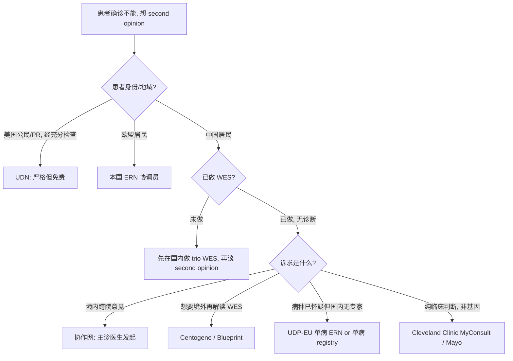

# UDN / UDP-EU / 协作网 / 商业 Second Opinion 申请流程参考

本文件汇总跨境/跨院罕见病会诊的主要可用通道，面向中国大陆确诊不能的患者或其主诊医生。内容基于公开资料，申请前仍须到各项目官网核实最新政策。

---

## 1. 对比概览表

| 程序名 | 地区 | 费用 | 时间线 | 适配患者 | 关键限制 | 官方域名 |
|---|---|---|---|---|---|---|
| **UDN** (Undiagnosed Diseases Network, NIH) | 美国 | 免费（评估、差旅由 NIH 承担） | 申请审核 2-4 月 + 评估访问 6-12 月 | 美国公民 / 绿卡 / 长期居民；经过充分国内检查仍未诊断 | 严格入选率（历史 ~30-40%）；仅限 US residents | undiagnosed.hms.harvard.edu |
| **UDP-EU / ERN** (European Reference Networks) | 欧盟 27 国 + 部分 EEA | 公费医疗覆盖本国患者；非欧盟自费 | 因 ERN 网络不同，通常 3-9 月 | 欧盟患者优先，通过本国 ERN 协调员转诊 | 非欧盟居民需找欧洲临床合作方代理 | ern-net.eu |
| **中国罕见病诊疗协作网** | 中国大陆 | 免费（医保内正常报销；会诊本身不另收费） | 国家级转诊 2-6 周 | 国内协作网成员医院主管医生发起 | 仅限协作网内部体系；不做境外转诊；不共享境外数据 | rarediseases.chinasdp.com（/ rarediseaseregistry.cn） |
| **Centogene** | 德国 (Rostock) | 约 €800-3000 (临床评估 + 基因再解读) | 4-8 周 | 已有 WES/WGS 原始数据但未诊断；需专业再分析 | 自费；送样涉及跨境人类遗传资源合规 | centogene.com |
| **Blueprint Genetics** | 芬兰 / 美国 | 约 US$500-2500 per panel/WES | 4-6 周 | 想换一家 lab 做基因再解读 / 复测 | 主要服务临床机构，直接患者通道有限 | blueprintgenetics.com |
| **PreventionGenetics** (Exact Sciences) | 美国 WI | 约 US$500-2500 | 3-6 周 | 同上，基因再解读 | 同上 | preventiongenetics.com |
| **Cleveland Clinic MyConsult** | 美国 | 约 US$565-1850 per consultation | 7-14 个工作日 | 临床专科 second opinion（非基因专项） | 仅文档会诊，不做实地检查 | my.clevelandclinic.org/online-services/myconsult |
| **Mayo Clinic Remote Second Opinion** | 美国 | 约 US$1500-2000 | 2-3 周 | 临床疑难诊断 second opinion | 同上 | mayoclinic.org |
| **IRDiRC associated registries** | 国际 | 免费 | 病种相关 | 已知病种但想加入 natural history study | 需要已有诊断或强烈怀疑的诊断 | irdirc.org |

---

## 2. UDN 详细流程 (Undiagnosed Diseases Network)

### 2.1 资格要求

- **居住/身份**：美国公民、永久居民或美国境内长期居留；有效美国住址 ± 能到 UDN 临床 site 实地评估
- **医学条件**：经过充分国内 workup（多次专科评估 + 至少一次 WES/WGS，或强烈理由未做）仍无诊断
- **临床医生推荐**：必须由患者的美国在地 treating physician 发起推荐，不是病人自己直接提交
- **材料完整**：完整英文病历摘要，既往基因检测 raw data/reports，家族史，影像关键片

### 2.2 申请材料

1. **Referral letter** from the treating physician（英文，包含：现病史、既往检查、为什么怀疑是 undiagnosed disease、希望 UDN 解决的问题）
2. **Medical records summary**（英文，≤ 20 页；影像/病理报告翻译；时间线清晰）
3. **Family history / pedigree**（至少三代）
4. **Prior genetic test reports**（WES/WGS/panel/microarray 的 raw data 链接 + 解读报告）
5. **Imaging key slices**（DICOM 去标识化）
6. **Informed consent to share de-identified data** with UDN researchers

### 2.3 时间线

1. **Week 0**：在线提交 Application portal
2. **Week 4-8**：UDN Coordinating Center 初审（medical review committee）
3. **Week 8-16**：某一 clinical site (Harvard, Stanford, Duke, UCLA 等 12 家) 决定是否 accept
4. **Month 4-6**：Accepted 患者被邀请到 clinical site 做 5-7 天 in-person evaluation（包括临床检查、additional sequencing、functional studies）
5. **Month 6-12**：Site team + UDN-wide discussion；可能 trio WGS、RNA-seq、metabolomics、model organism functional validation
6. **Month 12+**：返回诊断 / 新变异 / 或 "still undiagnosed" 结论

### 2.4 联系方式 / 入口

- 官网：https://undiagnosed.hms.harvard.edu/
- Apply portal：https://undiagnosed.hms.harvard.edu/apply/
- 参与 sites 列表（官网 Clinical Sites 栏目）
- Email: udnccc@childrensnational.org（Coordinating Center）

### 2.5 中国患者现实建议

- 直接申请 UDN 会因居住条件被拒
- 可行路径：(a) 真的有美国亲属 + 长期居留条件；(b) 放弃 UDN，看 UDP-EU 或商业通道

---

## 3. UDP-EU / ERN 流程

### 3.1 体系结构

- **ERN = European Reference Networks**：欧盟 2017 起建立的 24 个专病网络，每个网络覆盖一大类罕见病
- 代表性网络：
  - ERN-RND (rare neurological diseases)
  - ERN EURO-NMD (neuromuscular)
  - ERN ITHACA (intellectual disability, congenital malformations)
  - ERN BOND (bone disorders)
  - ERN EuroBloodNet (hematological)
  - ERN GENTURIS (genetic tumour risk syndromes)
  - ERN MetabERN (inherited metabolic disorders)
  - ... 共 24 个

### 3.2 正式流程

1. 患者所在欧盟成员国的协调医院 (HCP, Healthcare Provider member of ERN) 发起 CPMS (Clinical Patient Management System) panel
2. ERN 内多国专家 60 天内回复会诊意见
3. 诊断/治疗建议返回给本地协调医师

### 3.3 非欧盟患者路径（中国患者）

- **不可直接注册 CPMS**：CPMS 只开放给 ERN 认证 HCP
- **可行方案 A**：如有欧洲亲属，通过其本地 GP → 本国协调 HCP → ERN
- **可行方案 B**：委托欧洲私立罕见病中心（如 Italy 的 Bambino Gesù International Office、German 的 University Hospital Heidelberg Center for Rare Diseases）作为付费接诊方，由其决定是否 escalate 到 ERN
- **可行方案 C**：单病 international registry（如 EpiCARE 单病 natural history），门槛低于 ERN，直接病友组织接触
- 材料同样需要英文，HPO 编码，pedigree，基因报告

### 3.4 官方入口

- ERN 总网：https://health.ec.europa.eu/european-reference-networks_en
- 专病 ERN 列表：https://ern-net.eu/

---

## 4. 中国罕见病诊疗协作网详细流程

### 4.1 协作网架构（2024 年统计）

- **1 家国家牵头医院**：北京协和医院（罕见病综合诊疗中心）
- **32 家省级牵头医院**（各省 1 家，新疆、西藏独立）
- **约 324 家成员医院**（地市级三甲）
- 配套：国家罕见病注册登记系统 (NRDRS)、罕见病质控中心

### 4.2 如何触发跨院会诊

**入口只能是主诊医生，不是患者本人。** 流程：

1. 成员医院主诊医师在协作网 HIS/专网提交疑难病例讨论申请
2. 省级牵头医院专家组先行审阅；简单的直接在省内解决
3. 真正疑难的上报北京协和国家中心
4. 国家中心组织多学科（genetics / 相关专科 / 病理 / 影像）远程视频会诊
5. 会诊意见返回主诊医师；通常 2-6 周

### 4.3 远程视频平台

- 官方平台：国家罕见病诊疗协作网远程会诊系统（HIS 内置入口，或医院信息科对接）
- 使用患者不需要额外账号；但本地医院信息系统必须接入协作网

### 4.4 与 UDN 的主要区别

| 维度 | UDN | 中国协作网 |
|---|---|---|
| 诊断"新"病能力 | 强（trio WGS + 功能验证） | 主要是已知病的专家确认 |
| 是否做额外测序 | 会 | 一般不；靠已有检测 |
| 境外数据共享 | 默认 | 不 |
| 费用 | 免费 | 会诊免费 |
| 患者直接申请 | 需美国医师推荐 | 必须主诊医生发起 |
| 适合场景 | 已知未诊断，想找新病 | 国内专家资源整合 |

### 4.5 官方入口

- 国家卫健委文件：《关于建立全国罕见病诊疗协作网的通知》（国卫医函〔2019〕45 号）
- 北京协和罕见病诊疗中心：http://www.pumch.cn/
- 注册登记系统 NRDRS：https://www.nrdrs.org.cn/

---

## 5. 商业 Second Opinion 对比

### 5.1 Centogene (Germany)

- **适用**：已有 WES/WGS 但报告无诊断，希望由 Centogene 团队重新解读 + 额外临床评估
- **流程**：填写 online intake → 签 Informed Consent & quote → 邮寄血样 / 唾液 / 上传 FASTQ/BAM → 4-8 周返回 report
- **费用**：re-analysis-only €800-1500；加做 WES 或 mitochondrial ~€2000-3000
- **中国患者**：跨境送样需满足《人类遗传资源管理条例》（见第 7 节）
- **官网**：https://www.centogene.com/

### 5.2 Blueprint Genetics (Finland / US, part of Quest Diagnostics)

- **适用**：主要是重新做 panel / WES / reanalysis
- **价格**：US$500-2500 per test
- **中国患者通道**：需国内代理或海外临床方下单；直接患者通道不成熟

### 5.3 PreventionGenetics (US WI, Exact Sciences)

- **同 Blueprint**，技术 solid、报告标准
- **官网**：https://www.preventiongenetics.com/

### 5.4 Cleveland Clinic MyConsult

- **适用**：临床会诊（心脏/肿瘤/神经等某个具体专科），非基因专项
- **价格**：US$565（non-physician review）- US$1850（with physician phone consult）
- **周转**：10-14 工作日
- **材料**：英文病历、影像 DICOM
- **官网**：https://my.clevelandclinic.org/online-services/myconsult

### 5.5 Mayo Clinic Remote Second Opinion

- **适用**：复杂诊断 second opinion（传统临床 focus）
- **价格**：US$1500-2000
- **周转**：2-3 周
- **官网**：https://www.mayoclinic.org/

### 5.6 所需材料（通用）

1. 完整英文病历翻译
2. 影像 DICOM（去 PHI）
3. 基因报告 PDF + raw data（如 VCF/FASTQ）
4. 既往差异诊断 + 排除依据
5. 明确的咨询问题（1-3 个）

---

## 6. 适配性选择决策树

### 决策口诀（中文）

- **没做 WES** → 先做 WES（trio 最好），再谈 second opinion
- **已做 WES 无诊断 + 想留在国内** → 协作网
- **已做 WES 无诊断 + 愿意付费 + 有海外渠道** → Centogene re-analysis
- **有强烈怀疑的具体病种** → 单病 ERN / 单病 registry / 单病 advocacy group
- **是临床判断不是基因问题** → Mayo / Cleveland 临床会诊
- **真有 US 居住身份** → UDN 值得一试

---

## 7. 合规与法律

### 7.1 《中华人民共和国人类遗传资源管理条例》(2019 / 2023 实施细则)

关键红线：
- **向境外提供中国人类遗传资源信息**（包括 WES/WGS 测序数据）需在**科技部人类遗传资源管理办公室**备案或审批
- **向境外提供中国人类遗传资源材料**（血/组织样本）需行政许可
- 单例个人患者为自己诊疗目的的数据出境，属于**豁免情形**之一，但仍建议走"自述声明 + 医院伦理确认"路径
- 商业机构大规模送样必须经批准

### 7.2 实务建议

1. **只送"诊疗所需最小数据"**：首选 VCF 中 rare/novel variants 列表；不得已才送 BAM/FASTQ
2. **签署 Data Use Agreement**：明确接收方不得 reuse、不得商业化、诊断完成后销毁/仅保留报告
3. **走医院伦理备案**：让国内主诊医院出具"支持患者境外会诊"伦理意见，保留书面记录
4. **境外接收方尽量在 GDPR 覆盖区域**（德国、芬兰）比 US 合规压力小

### 7.3 翻译材料资质

- 推荐：
  - 国内 GCP-trained 双语医生亲自翻译 + 盖医院公章
  - 北京/上海涉外公证处认证的医学翻译公司（如有司法用途）
- **不推荐**：纯机翻（Google/DeepL）直接提交；海外专家会明显感觉到不专业

### 7.4 数据跨境前脱敏最低要求

- 姓名 → anonymized_id (e.g., PT-2026-001)
- 生日 → age range (e.g., 14-year-old, or 10-14 range)
- 地址 → country + region (e.g., "China, East Coast")
- 医院名 → 保留机构名（对专家判断诊断能力有用）但去掉具体病案号
- 影像：DICOM metadata 用 DicomAnonymizer / CTP tools 去 PHI tags
- 家属：去除姓名，用 relation-based label (e.g., "elder sister, age 18")

---

## 8. 参考链接汇总

- UDN: https://undiagnosed.hms.harvard.edu/
- ERN: https://health.ec.europa.eu/european-reference-networks_en
- 协作网（北京协和）: http://www.pumch.cn/
- NRDRS: https://www.nrdrs.org.cn/
- Centogene: https://www.centogene.com/
- Blueprint Genetics: https://blueprintgenetics.com/
- PreventionGenetics: https://www.preventiongenetics.com/
- Cleveland Clinic MyConsult: https://my.clevelandclinic.org/online-services/myconsult
- Mayo Clinic RSO: https://www.mayoclinic.org/
- IRDiRC: https://irdirc.org/
- 科技部人类遗传资源管理: https://www.most.gov.cn/
